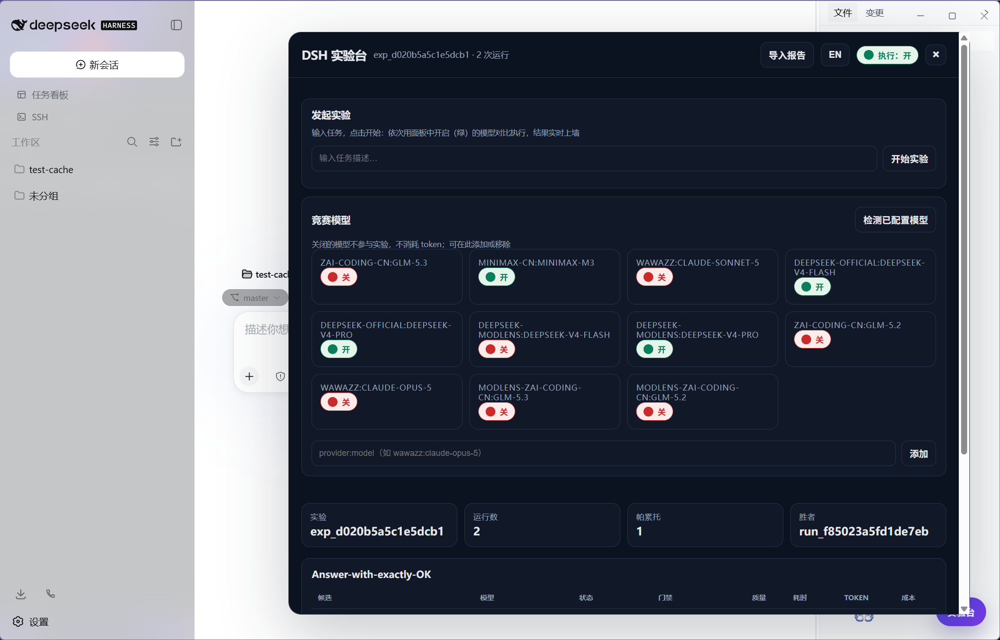
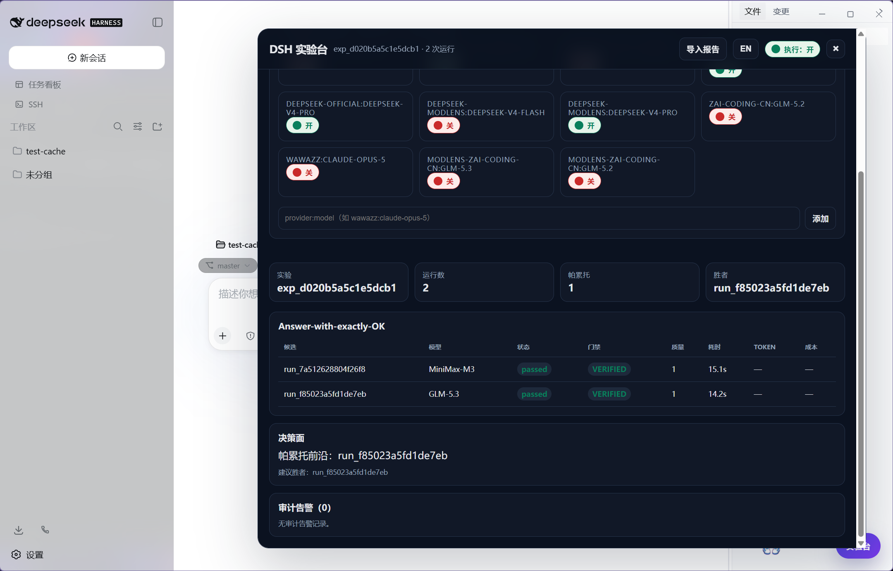

# DSH Arena

DSH Arena 是 DeepSeek Harness（DSH）的本地实验与评估工作台插件。它拿同一个任务、同一份仓库快照去对比多个候选 profile：先把没过硬性门槛（hard gate）的跑法拦下来，再做 Pareto 排序；导出报告时自动脱敏常见凭据；还带一个 Web 实验台。





## 现在能做什么

- 原子化的本地持久化存储，运行队列有并发上限，支持中止和超时
- 确定性 hard gates：不满足直接判失败，不进入排序
- Pareto 排名与 winner 汇总
- Web 矩阵界面，实时刷新
- 执行走 adapter 驱动，不猜、不调 DSH 没文档化的 headless 命令

## 兼容性边界

- 只按官方文档化的 Cordis 契约写：`name`、`apply(ctx, config)`、Schemastery 的 `Config` schema
- 不碰 DSH Client/Host 没文档化的内部接口；能力识别用特性探测（`ctx.arena`），不用私有槽位
- 真实 DSH 上的 Web / Headless E2E 还没跑通，所以本仓库不声称 100% 兼容。等真机验证过了再改口

## 构建

Node 24 自带 TypeScript 类型剥离，构建不需要额外依赖：

```powershell
cd dsh-arena
npm run build
npm test
```

产物是 `lib/index.js`（host 入口）和 `lib/client.js`（浏览器入口）。package.json 里声明了 `dsh.bundle.patch` 和 `dsh.client`；目前 `private: true`，还没发 npm。

## 装进 DSH

先构建：

```powershell
npm run build
```

然后在官方 DeepSeek Harness 检出目录里执行（或把 `pnpm dsh` 换成全局安装的 `dsh` 命令）：

```powershell
pnpm dsh plugin --profile web add <本目录路径>
pnpm dsh --profile web --dump-config
pnpm dsh --profile web web
```

装到 `web` profile 后，浏览器访问和 DeepSeek Harness Desktop 桌面端都能看到——桌面端管理的就是这个 profile 的服务，不用装两遍。

不想走源码目录安装的话，先 `npm pack` 打出本地 tgz，再直接 add 那个文件：

```powershell
pnpm dsh plugin --profile web add dsh-arena-0.2.1.tgz
```

装完可以用 `pnpm dsh --profile web --dump-config` 查一下，输出里有 `# == dsh-arena` 就说明装上了。卸载：

```powershell
pnpm dsh plugin --profile web remove dsh-arena
```

`cordis.patch.yml` 是发布用的补丁，解析为 `name: dsh-arena`，里面没有本机绝对路径。

## 本地开发

`cordis.local.patch.yml` 直接指向工作区里的 TypeScript 入口，改完刷新即可。从 DSH 检出目录跑：

```powershell
pnpm dsh web --patch <本目录>/cordis.local.patch.yml
```

项目挪了位置，只需要改这个文件里的绝对路径。

## 服务接口

host 服务暴露的操作都是显式的：

`startExperiment(input)`、`recordRun(run)`、`getSnapshot()`、`report(directions)`、`subscribe(listener)`、`clear()`、`flush()`、`getPersistenceStatus()`、`bindExecutor(adapter, options)`

- 第一次修改前先 `await arena.ready`
- 只有 `bindExecutor` 能创建运行编排器，adapter 必须由调用方传入——它不会自己发明 DSH headless 命令，也不会悄悄发起模型调用

持久化默认写到 `.dsh-arena/state.json`（同目录临时文件 + 原子重命名），想关掉就设 `persistencePath: false`。路径都限制在 `dataRoot` 内，越界路径直接拒绝。

## Web 实验台与离线报告

界面是 Shadow DOM 组件：当 `ctx.arena` 服务可用（提供 `getSnapshot` / `report` / `subscribe`）时实时渲染。没有假设一定有浏览器 Host bridge，所以提供了「导入报告」：选一个本地 Arena JSON 报告，离线渲染出：

- 候选/模型运行矩阵
- run 与 hard gate 状态
- 质量、时长、token、成本指标
- Pareto 候选与建议 winner
- 审计告警

导入的内容只用 DOM API 和 `textContent` 渲染，不拼动态 HTML。文件留在浏览器里，没有上传或遥测。

## 测试与安全

`npm test` 在 Node 24 上直接跑，不需要装运行时依赖。

- 核心不会自动执行生成的 DSH 命令，不会删 worktree，git 参数一律用数组构建
- 实验 runner 执行的是你自己配置的候选命令（`--dsh`）——Windows 上 pnpm/dsh 是 `.cmd` 启动器，必须经命令解释器拉起；任务文本拼入命令前已做引号转义。信任边界：跑的是你自己机器上、你自己写的命令
- 导出 JSON/JSONL/Markdown 前，按字段名和值对内联的 authorization / token / key / secret / password / cookie 做脱敏
